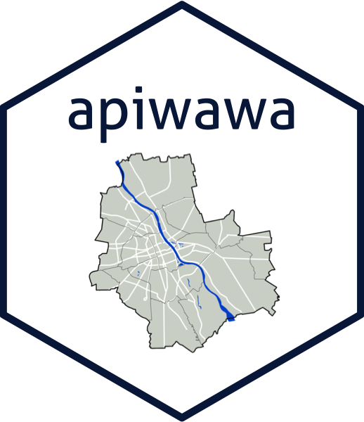

<!-- README.md is generated from README.Rmd. Please edit that file -->

# apiwawa 

## Overview

apiwawa is an API wrapper written in R (with httr2 package). For now
there are functions for querying 19115 city contact center. All Warsaw
API endpoints and their documentation can be found
[here.](https://api.um.warszawa.pl)

## Installation

``` r
# install.packages("devtools")
devtools::install_github("krystiankorzec/apiwawa")
```
